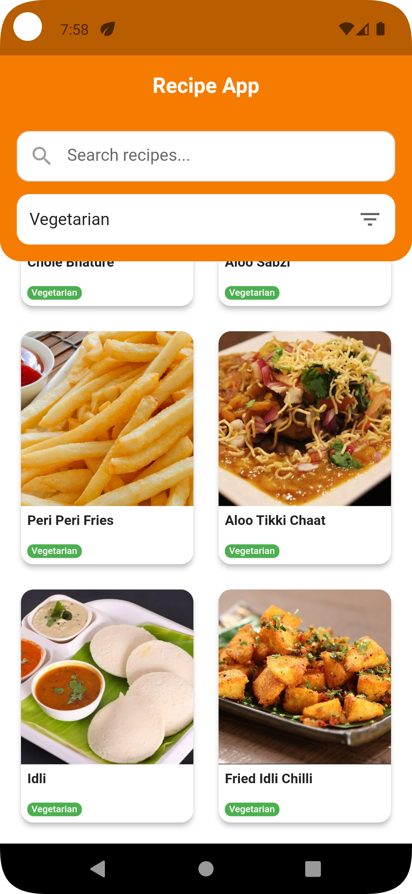
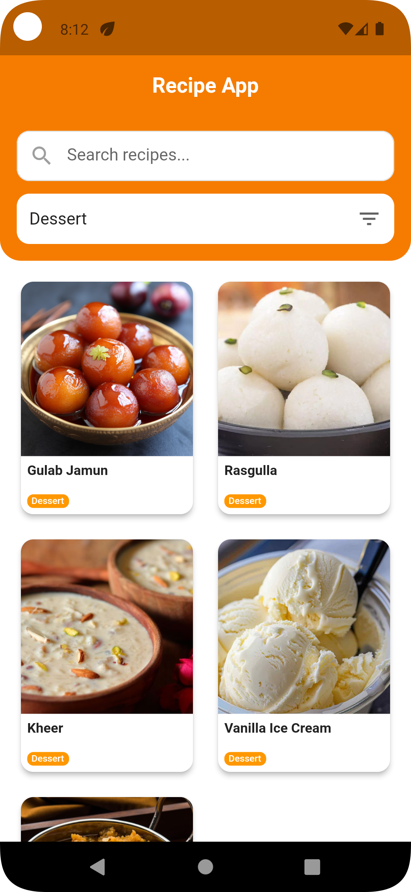

# Indian Recipe App

A complete Flutter Indian Recipe App with authentic Indian cuisine, modern UI design and state management using Provider.

## Features

### Indian Recipe Management
- **Authentic Indian Recipes** with detailed information
- **Recipe Categories**: Vegetarian, Non-Veg, Dessert, Beverage
- **Search Functionality** to find recipes by name
- **Category Filtering** with dropdown selection

### Recipe Details
- **Full Recipe Information** including ingredients and steps
- **High-Quality Images**
- **Step-by-Step Instructions** 
- **Ingredient Lists** 

### Installation

1. **Clone or download the project**
   ```bash
   git clone https://github.com/bhartisahu09/Receipe_App
   cd recipe_app
   ```

2. **Install dependencies**
   ```bash
   flutter pub get
   ```

3. **Run the app**
   ```bash
   flutter run
   ```

## Screenshots

| Receipe | Receipe details | Filter Categories | Search |
|:---:|:---:|:---:|:---:|
| |  |  |   |

## Project Structure

```
lib/
├── data/
│   └── recipes.dart          # Recipe data model and static recipes
├── provider/
│   └── recipe_provider.dart  # State management with ChangeNotifier
├── screens/
│   ├── home_screen.dart      # Main screen with search and grid
│   └── recipe_detail_screen.dart # Recipe detail view
├── widgets/
│   └── recipe_card.dart      # Reusable recipe card widget
└── main.dart                 # App entry point with Provider setup
```

## Indian Recipe Categories

- **Vegetarian** (Green) - Plant-based Indian dishes
- **Non-Veg** (Red) - Meat and fish Indian curries  
- **Dessert** (Orange) - Traditional Indian sweets
- **Beverage** (Purple) - Hot and cold drinks

## Dependencies

- **provider** - State management

## Future Enhancements

- [ ] Add favorite recipes functionality
- [ ] Implement recipe sharing
- [ ] Add cooking timer feature
- [ ] Include nutritional information
- [ ] Add recipe ratings and reviews
- [ ] Implement offline storage
- [ ] Add regional Indian cuisine categories
- [ ] Include spice level indicators
- [ ] Add traditional cooking methods
- [ ] Include festival-specific recipes
